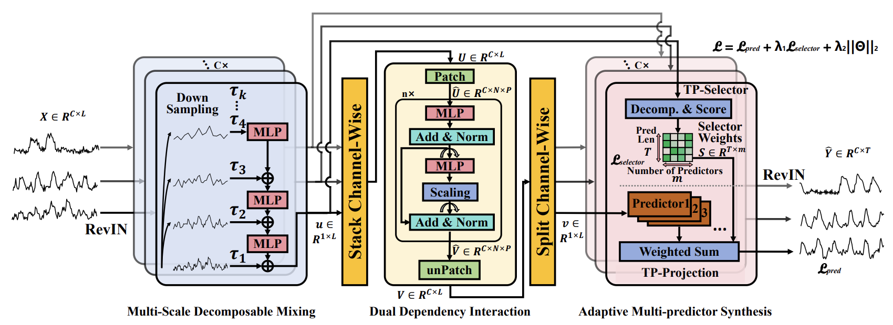

<p align="center">
    
</p>


# Adaptive Multi-Scale Decomposition Framework for Time Series Forecasting

[](https://arxiv.org/abs/2406.03751)

## Overview
The Adaptive Multi-Scale Decomposition Framework (AMD) is a cutting-edge solution for time series forecasting, incorporating three main components: the Multi-Scale Decomposable Mixing (MDM) Block, the Dual Dependency Interaction (DDI) Block, and the Adaptive Multi-predictor Synthesis (AMS) Block.

<p align="center">
    
</p>

## Prerequisites
To get started, ensure you are using Python 3.10. Install the necessary dependencies by running:

```bash
pip install -r requirements.txt
```

## Data Preparation
Download the required datasets from [Autoformer](https://github.com/thuml/Autoformer) and [iTransfomer](https://github.com/thuml/iTransformer). Organize the data in a folder named `./data` as follows:

```
data
├── electricity.csv
├── exchange_rate
├── ETTh1.csv
├── ETTh2.csv
├── ETTm1.csv
├── ETTm2.csv
├── solar_AL.txt
├── traffic.csv
└── weather.csv
```

## Training Example
All training scripts are located in the `./scripts` directory. The details of the hyper-parameter settings are in Appendix C.4 in our paper. To train a model using the `weather` dataset, run the following command:

```bash
./scripts/Weather.sh
```

## Citation
If you find this repository helpful, please cite our paper:

```bibtex
@inproceedings{hu2025adaptive,
  title={Adaptive Multi-Scale Decomposition Framework for Time Series Forecasting},
  author={Hu, Yifan and Liu, Peiyuan and Zhu, Peng and Cheng, Dawei and Dai, Tao},
  booktitle={Proceedings of the AAAI Conference on Artificial Intelligence},
  year={2025}
}
```

## Acknowledgements
We gratefully acknowledge the following GitHub repositories for their valuable contributions:

- [Autoformer](https://github.com/thuml/Autoformer)
- [DLinear](https://github.com/cure-lab/LTSF-Linear)
- [Time-Series-Library](https://github.com/thuml/Time-Series-Library)
- [PatchTST](https://github.com/yuqinie98/PatchTST)
- [iTransformer](https://github.com/thuml/iTransformer)

## Contact
For any questions or inquiries, please submit an issue or contact us via email:

- Yifan Hu ([huyf0122@gmail.com](mailto:huyf0122@gmail.com))
- Peiyuan Liu ([lpy23@mails.tsinghua.edu.cn](mailto:lpy23@mails.tsinghua.edu.cn))
